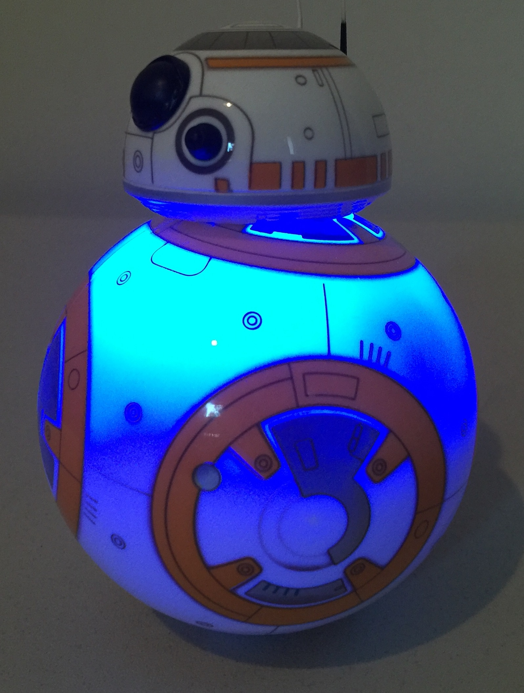
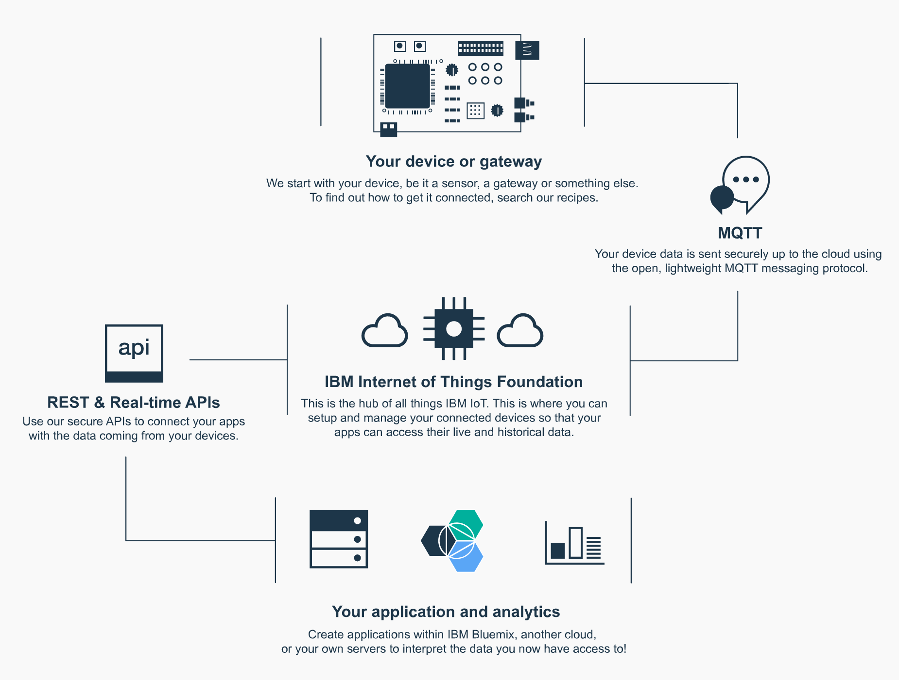
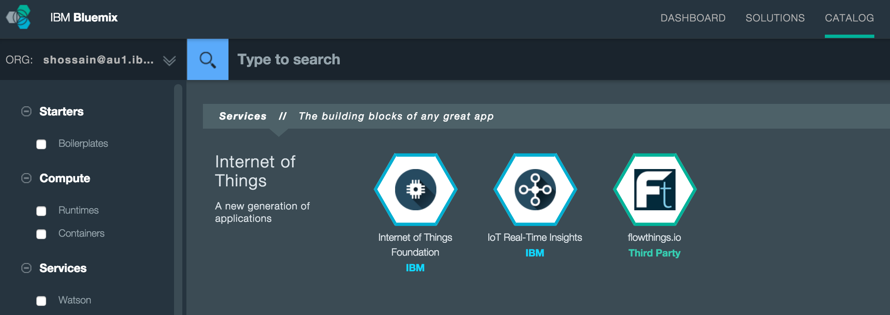
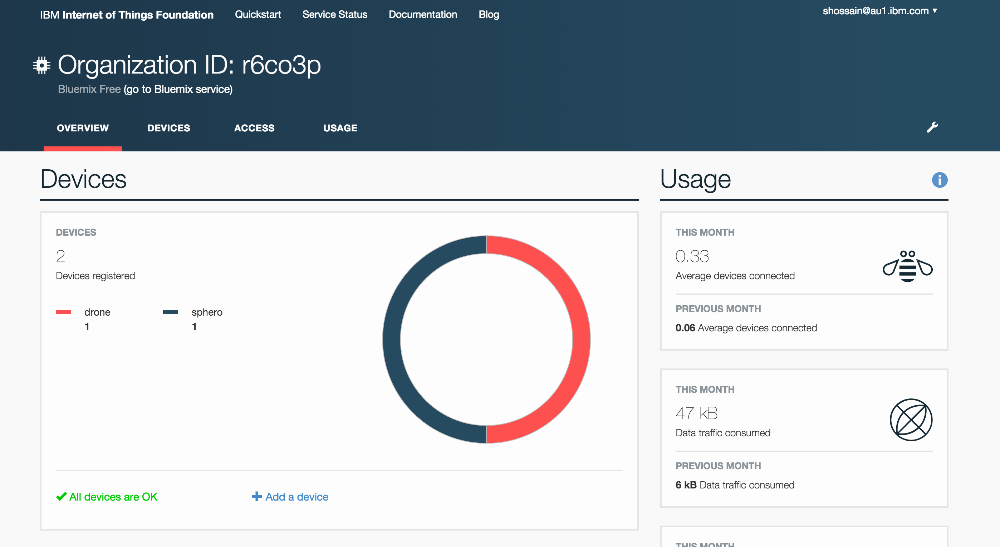
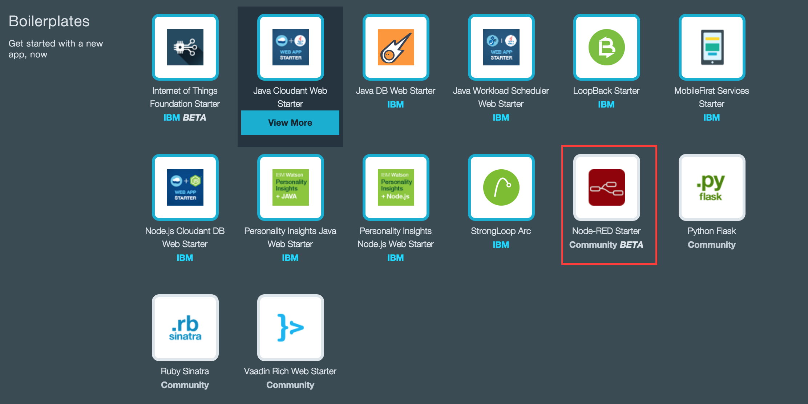
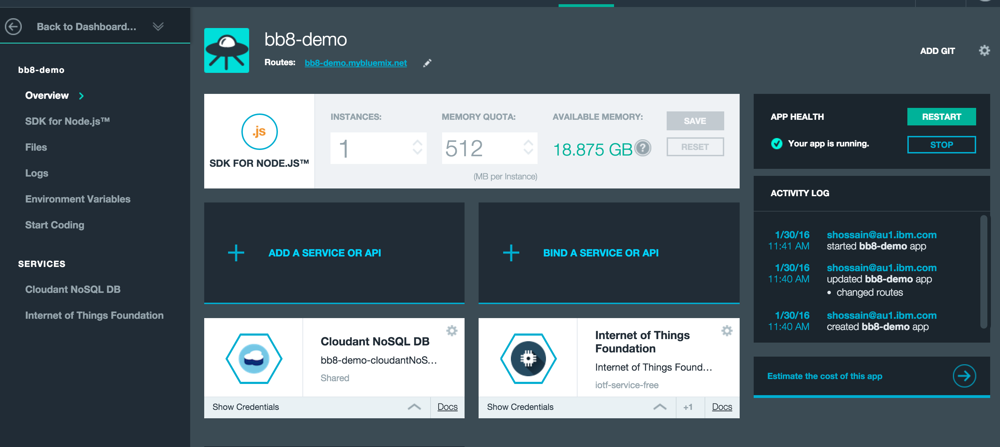
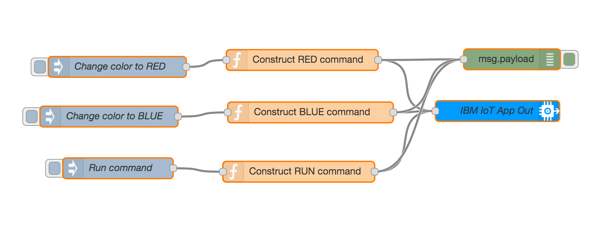

# Sample code to control a BB-8 Droid from anywhere in the world



Suppose your Star Wars BB-8 droid is in Melbourne and you are in San Francisco. You are controlling the BB-8 from an internet browser from San Francisco!! Wouldn't it be nice?

This is a sample project to control a BB-8 Droid
using MQTT, the [IBM internet of Things Foundation](http://www.ibm.com/cloud-computing/bluemix/solutions/iot/), and the [sphero.js](https://github.com/orbotix/sphero.js),
. This project also uses the MQTT wrapper from the [parrot-sample](https://github.com/IBM-Bluemix/parrot-sample).

You can control the color of the droid using a Node-RED flow. Sample flow has been included below. The summary of functionalities is:

1. BB-8 will change color to Green when connected to IoTF via BLE compatible laptop.
2. You can issue color change command
3. You can issue run command and droid will run for 1.5 seconds and then randomly change color every second.


# Running The Sample

## Hardware

You will require the following devices for this demo.

1. A BB-8 Droid
2. A laptop which supports BLE. The BB-8 will be connected to the laptop via BLE. BB-8 controller code will run on the laptop. I used a MacBook Pro (Retina, 15-inch, Mid 2014).

As you can see in the diagram below, you laptop will be working as the IoT gateway to connect to BB-8 and receiving the MQTT commands. Here the gateway subscribes to `iot-2/cmd/run/fmt/json` topic.



## Getting The Code

`$ git clone https://github.com/shamimshossain/bb8-bluemix.git`

## Pre-requisite tasks

Create an instance of Internet of Things Foundation from Bluemix catalog.



From IoTF Dashboard, perform the following tasks.

1. Click the Devices tab and click Add Device.
2. Create a new Device Type called "sphero".  
3.  In the Device ID field enter a unique ID for your drone.
4. Click Continue

At the completion of these steps you will see information about the device you registered.  Make note of the auth-token field as you will need that to run the sample.

**The IoTF service can not retrieve these authentication details for you later. So make sure to store these in a secure place**

Next get API keys for your application.

1.  Click on the API Keys tab
2.  Click the New API Key link
3.  You will see a Key and Auth Token displayed.

Take note of the Key and the Auth Token as you will need these to run the sample.

**The IoTF service can not retrieve these authentication details for you later. So make sure to store these in a secure place**

In the root of the repository you cloned you will find a file named `sphero-config.properties`.  Following is the content of the properties file.

```
#Device ID you use when you register with the IoT foundation
deviceid=yourdroneid

#For controller (device)
authtoken=yourauthtoken
#For the app (publisher)
apikey=yourapikey
apitoken=yourapitoken
```

Replace the values of the deviceid, authtoken, apikey, and apitoken with the values you got when creating the device and app in the IoT Dashboard.

Following is a screenshot of IoTF dashboard.



## Set up the application to run from your laptop


1. Open a terminal window, `cd` to the root of the repository, and run `npm install` to install all the dependencies.
2. Place your BB-8 near your BLE compatible laptop.
3. Now start up the controller code by running `node spheroDemo.js`

4. Your BB-8 droid will be connected to IoTF via BLE compatible laptop and change color to green. You will see an output similar to following  from the terminal.
```
**** Start debug info *****
Connected to BB-8
BB-8 is changing color to green to indicate that it is connected
**** End debug info *****
r6co3p.messaging.internetofthings.ibmcloud.com
Output of ping command
{ sop1: 255,
  sop2: 255,
  mrsp: 0,
  seq: 0,
  dlen: 1,
  data: <Buffer >,
  checksum: 254 }
End of ping data
MQTT client connected to IBM IoT Cloud.
Connected Sphero ID: spheroownedbyshamim
subscribed to iot-2/cmd/run/fmt/json
```
5. You are now ready to create an Node-RED Starter app from Bluemix catalog.



## Node-RED




1. Bind the IoTF service created before to this app. The resultant application dashboard looks like the diagram above.
2. Now copy the following Node-RED flow and import into Node-RED.

```
[{"id":"180c60f4.e7f39f","type":"ibmiot out","z":"5fa8453c.a057bc","authentication":"boundService","apiKey":"","outputType":"cmd","deviceId":"spheroownedbyshamim","deviceType":"sphero","eventCommandType":"run","format":"json","data":"___","name":"IBM IoT App Out","service":"registered","x":756,"y":361,"wires":[]},{"id":"b7792b22.4886d8","type":"inject","z":"5fa8453c.a057bc","name":"Run command","topic":"","payload":"","payloadType":"none","repeat":"","crontab":"","once":false,"x":206,"y":444,"wires":[["f29b07a3.0d64f8"]]},{"id":"f29b07a3.0d64f8","type":"function","z":"5fa8453c.a057bc","name":"Construct RUN command","func":"msg.payload = JSON.stringify({\n    d: {\n        action : \"#spherorun\"\n      }\n});\nreturn msg;","outputs":1,"noerr":0,"x":468,"y":449,"wires":[["180c60f4.e7f39f","d1c575b9.2e3a88"]]},{"id":"d313ea30.2cec18","type":"inject","z":"5fa8453c.a057bc","name":"Change color to RED","topic":"","payload":"","payloadType":"none","repeat":"","crontab":"","once":false,"x":205,"y":297,"wires":[["26e811fe.d917ee"]]},{"id":"26e811fe.d917ee","type":"function","z":"5fa8453c.a057bc","name":"Construct RED command","func":"msg.payload = JSON.stringify({\n    d: {\n        action : \"#red\"\n      }\n});\nreturn msg;","outputs":1,"noerr":0,"x":473,"y":287,"wires":[["180c60f4.e7f39f","d1c575b9.2e3a88"]]},{"id":"61c2c549.9e3d3c","type":"inject","z":"5fa8453c.a057bc","name":"Change color to BLUE","topic":"","payload":"","payloadType":"none","repeat":"","crontab":"","once":false,"x":193,"y":369,"wires":[["18100517.e7effb"]]},{"id":"18100517.e7effb","type":"function","z":"5fa8453c.a057bc","name":"Construct BLUE command","func":"msg.payload = JSON.stringify({\n    d: {\n        action : \"#blue\"\n      }\n});\nreturn msg;","outputs":1,"noerr":0,"x":485,"y":363,"wires":[["180c60f4.e7f39f","d1c575b9.2e3a88"]]},{"id":"d1c575b9.2e3a88","type":"debug","z":"5fa8453c.a057bc","name":"","active":true,"console":"false","complete":"false","x":777,"y":286,"wires":[]}]

```
Once you have imported the flow you will need to double click on the IBM IoT output node to open the configuration properties and replace the device ID with the device ID you registered your drone with in Bluemix. For example, replace `spheroownedbyshamim` with your deviceid.

This is how the flow looks like.


